

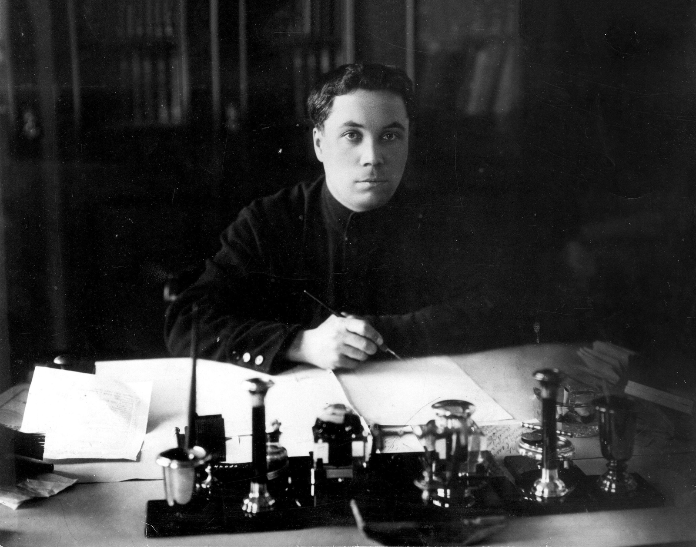 
<small>A.G. Beloborodov, People's Commissar of Internal Affairs of the RSFSR, at his work desk. 1927.</small>

## Table of Contents
1. [Introduction](#introduction)
2. [Formation. Childhood](#formation-childhood)
3. [Formation. The start of adulthood](#formation-the-start-of-adulthood)
4. [Revolution and Civil War](#revolution-and-civil-war)
5. [Romanovs in Yekaterinburg](#romanovs-in-yekaterinburg)
6. [Socialist construction](#socialist-construction)
7. [Behind Closed Doors](#behind-closed-doors)
8. [Reading Circle](#reading-circle)
9. [The End of Life: Investigation and Execution](#the-end-of-life-investigation-and-execution)

## Introduction

On October 26, 2021, it was the 130th anniversary of the birth of Alexander Georgievich Beloborodov, a prominent Soviet figure who played an important role in the history of our country during the difficult years of the Civil War and the subsequent interwar decades. Within the framework of the online exhibition, for the first time we present a complete collection of items and documents belonging to Alexander Georgievich Beloborodov from the collection of the Sverdlovsk Regional Museum. 

Born in a remote village at the Alexander Plant of the Perm province, Alexander headed the Praesidium of the Ural Regional Council at the age of 26, and in 1923 became the People's Commissar of Internal Affairs of the RSFSR. He participated in the decision to shoot the family of the last Tsar Nicholas II in Yekaterinburg in 1918. In the 1920s, Alexander Beloborodov joined the left opposition in the CPSU (b) and became the closest associate of L.D. Trotsky.

The left-wing opposition, as you know, lost in the intra-party struggle and its supporters, including our hero, lost their posts first, and then their lives. Their names were crossed out of the history of the revolutionary movement and became a scarecrow on the pages of the propaganda press, despite the fact that many of them previously held the most important positions in the Soviet authorities and the army. Through the biography of Alexander Georgievich Beloborodov we can follow the fate of an entire generation of people, who prepared the revolution, fought in the Civil War and ended up with getting not what they had dreamed of for so long time. 

We express our great gratitude to our partners: the Documentation Centre of Public Organisations of the Sverdlovsk Region, the State Archives of the Perm Territory, the Russian State Archive of Socio-Political History, the Documentation Centre of Modern History of the Rostov Region, the Russian State Military Historical Archive and the Aleksandrovsk Museum of Local Lore for the materials provided and the assistance provided to us. This is the only way, flipping through the contradictory and difficult pages of our history, can we get closer to a better understanding of our past and present.

## Formation. Childhood

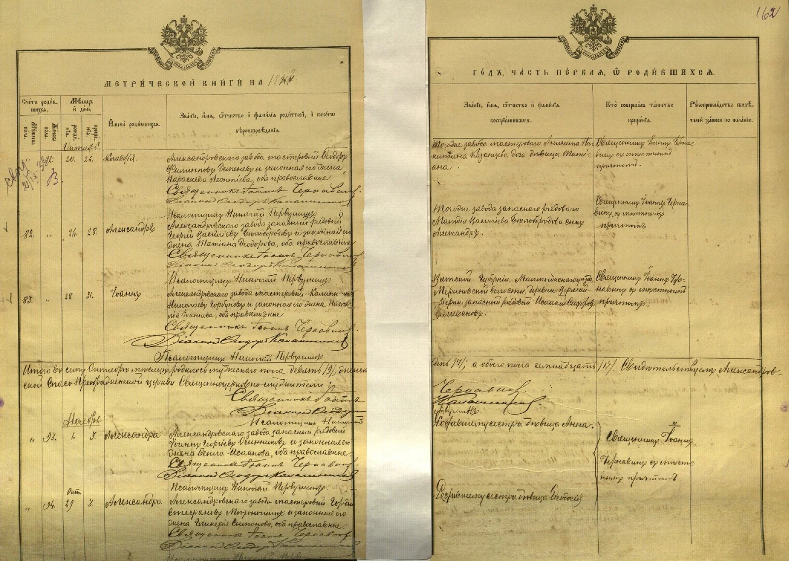 
<small>Record of A.G. Beloborodov's birth in the parish register, 1891.</small>

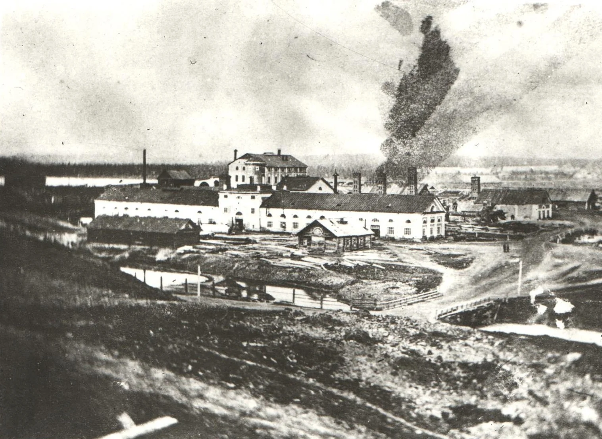 
<small>The Alexandrovsky Factory, Beloborodov's birthplace.</small>

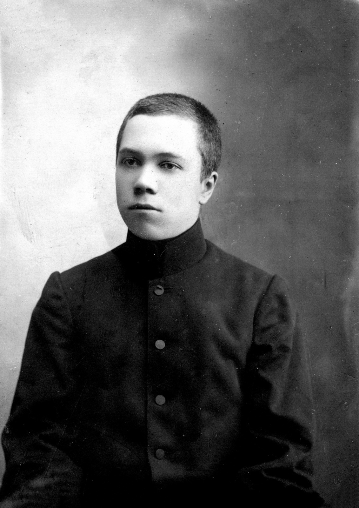 
<small>A.G. Beloborodov in his youth.</small>

> I have already spoken of the damp mines and ore pits. The factory was somewhat better, yet still far from good. The toll on health is plain to see: in 1874, at the Alexandrovsky factory, there were 141 widows for every 23 widowers. That year, 60 boys were born and 64 adult men died; in 1873, 67 deaths for every 64 births. Among women, births outnumbered deaths. The factory had 1,098 men and 1236 women. Death came most often during heavy labor. Adults died mainly of consumption, children of fever and want. Few died of old age — few lived so long.  
> *(V. I. Nemirovich-Danchenko, Kama and the Urals, 1890, pp. 367–368.)*

> The Alexandrovsky Factory. A remote place, the very picture of decline. Barely a hundred workers remained, labouring at the Lunevskie mines. There was a church and two schools, but no social life — not even the club for employees found elsewhere in the Urals. The only public institution was the Library of the Trusteeship of Public Sobriety.  
> *(Collection of Written Sources of the Sverdlovsk Regional Museum. Fond 5, Inv. 2, File 1, Folio 11. From the memoirs of A. G. Beloborodov, 1932.)*

> My hometown is the Alexandrovsky Factory settlement, former Solikamsk district, some twelve versts from the Kizel mines in the Northern Urals, along the Chusovaya–Solevarni railway branch.  
> I was born on 26 October 1891 to the worker Georgy Vasilievich Beloborodov and his wife Tatyana Fyodorovna.  
> I grew up in tolerable conditions: neither hungry nor cold, shod and clothed. Punishment for mischief was moderate. Apart from farm work, I was not put to labour early.  
> <…>  
> We owned our own house, divided in two. My paternal grandparents lived in the one-storey half; our family in the two-storey half. We kept a cow, three or four sheep, and about a dozen chickens — my grandfather kept a similar holding. In the garden my mother grew potatoes, cabbage, carrots, rutabagas, turnips, peas, beans, and onions. We never bought vegetables. The garden gave us our treats: steamed turnips, rutabagas, and stewed carrots were almost the only sweets this harsh northern place could offer. There were berries too — wild strawberries, raspberries, currants, rowan, and the barely edible bird cherry.  
> As the firstborn, I received more attention than the others. Our family was fairly large. Besides the two sisters and one brother still living,* two more sisters and another brother had died. The sisters died in childhood; the brother was executed by Kolchak's men in Tyumen in 1918.  
> *(Written in early 1912).*  
> For as long as I can remember, my childhood before school was oppressively monotonous. Winter lasted from early October to April — a full halfyear — with deep snow, blizzards, and bitter frosts. Snow buried everything; drifts rose higher than a fathom, reaching the eaves of low houses. Sleds sank straight in; pulling even an empty one was a struggle. There was nowhere to go. You stayed indoors.  
> The frost... The air grew so still and thin that breathing became hard. Sled runners creaked loudly, the sound carrying half a verst. Frostbite threatened face, ears, hands, and feet, often before you noticed. Even cows suffered frostbitten udders. In such cold, livestock stayed in warm barns. You could not go outside — and would not be let back in if you did. You simply stayed indoors.  
> But spring and summer made up for everything. With the thaw, snowmelt broke free and we built structures from wet snow. Once the snow was gone, came the season for games — chizh, gorodki, lapta, kites. Unfortunately, there was also far more work then: clearing the yard of manure, helping my mother and grandmother in the garden. Little time was left for games.

In 1903, Alexander completed primary school. Testimony from the 1908 investigation into the distribution of revolutionary leaflets — given by his parents and the headmaster — states: 

> "A. Beloborodov was one of modest and quiet disposition and always behaved well; he finished school as the top student and stood out among his peers in intellectual development."  
> *(State Archive of Perm Krai, fond 142, inv. 2, file 81, fol. 17 verso.)*

## Formation. The start of adulthood

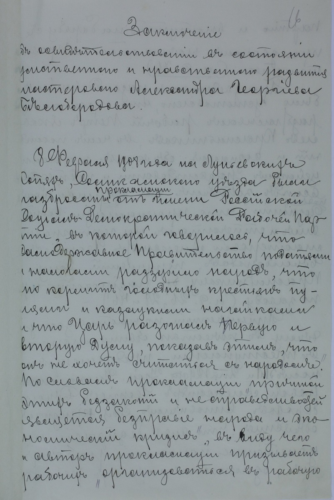 
<small>Testimony from the 1908 investigation into the distribution of revolutionary leaflets.</small>

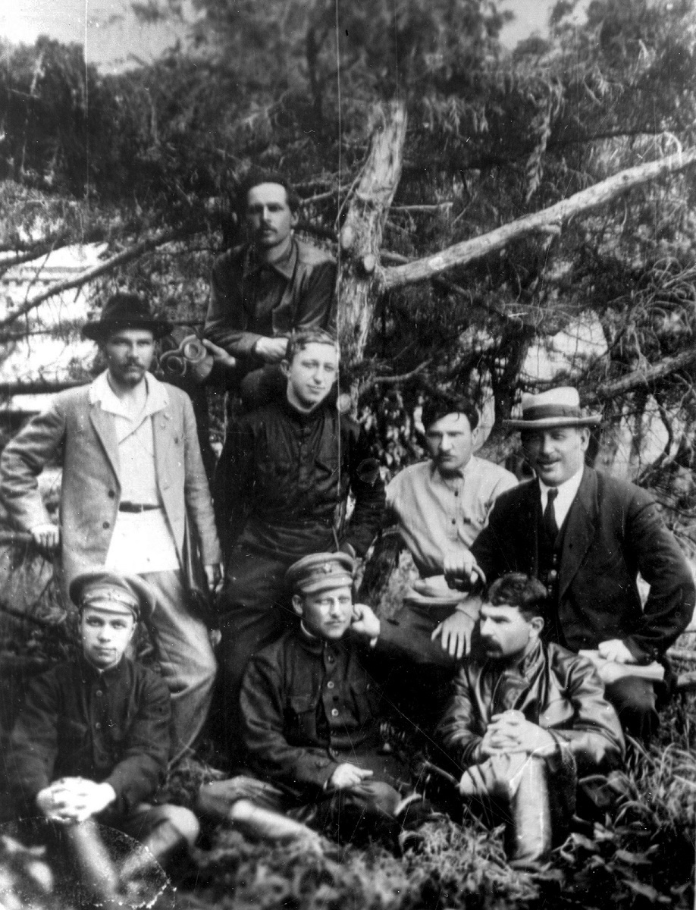 
<small>Group photograph, 1912-1914.</small>

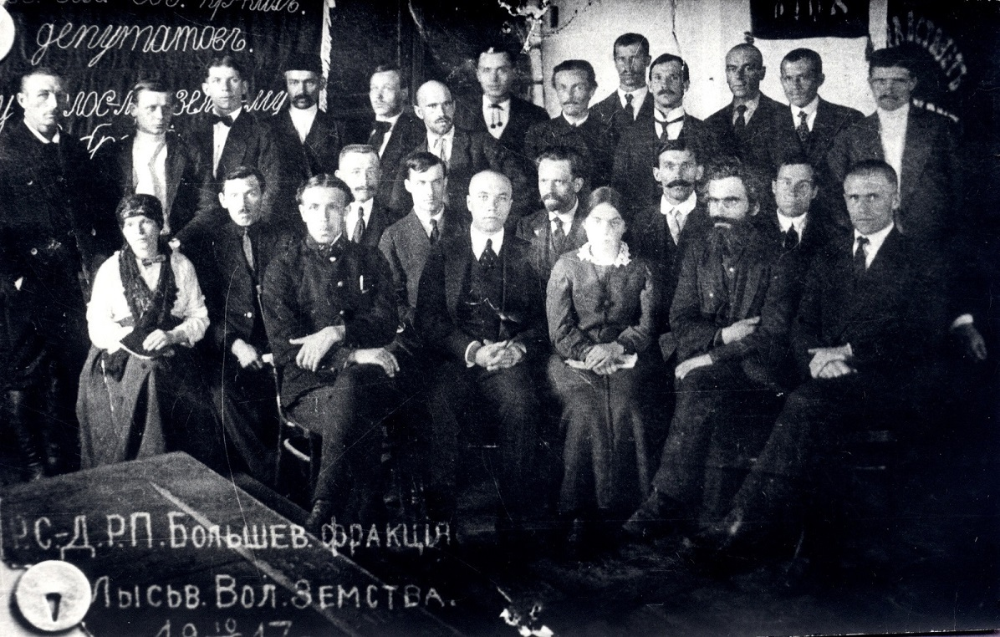 
<small>Bolsheviks of the Lysva Factory, 1917.</small>

> I joined the factory’s Gas-Electric Workshop in August 1905. My father, a master of gas engines, arranged it.  
> I was not yet 14, so my father added a year to my age. It worked.  
> My salary was set at 10 rubles per month.  
> *(Collection of written sources of the Sverdlovsk Regional Museum of Local Lore. F. 5. In. 2. F. 1. S. 61. From the memoirs of A.G. Beloborodov, 1932)*

> … I was transferred to the shop office as a messenger, then as an assistant to the clerk. My first revolutionary “baptism” came from distributing literature.  
> In early 1907, I joined the local Social Democratic organization. I became more active after meeting Andrei Válek (Yakov Chernyak), my first teacher. In summer 1907, I was elected a candidate member of the local Committee. After a lockout, I was dismissed in September. I returned home, worked as an electrician at the Lunevskiye Mines, and organized a Social Democratic group. After our first proclamation, I was arrested on February 8, 1908.  
> On September 29, 1908, I was convicted as a minor and sent to a reformatory, but there was “no room,” so I served my sentence in prison.  
> *(Alexander Grigorievich Beloborodov (autobiography) // Figures of the USSR and the Revolutionary Movement in Russia. Granat Encyclopedic Dictionary. – Moscow: Soviet Encyclopedia, 1989. pp. 359-360)*

From Beloborodov’s memoirs “The Tunnel” (Perm Prison, 1909):

> In the juvenile cell, there were over forty of us: politicals (mostly young, too young to be executed or sent to hard labor) and criminals. Among the criminals were housebreakers, train-robbers, murderers, pickpockets. We also had workers and peasants who had hurt someone in fights; we took them under our protection.  
> By then, our political group had grown by several Lbovtsy convicted to 8–10 years. The long-termers had a choice: get tuberculosis or escape.  
> *(CDOOSO F. 221 In. 2 F. 695. S. 1,2)*

> … While in prison, I was tried again for attempting to escape by digging a tunnel, but a jury acquitted me. I read a lot, was released in March 1912 after serving 3 years and 2 months plus 8 months of pre-trial detention, and returned to the Nadezhdinsk Factory as an electrician.  
> The Lena execution revived working-class life. I helped organize a workers’ cultural-educational society.  
> I corresponded with Pravda as “Igor,” was placed under surveillance, and on May 20, 1914, was arrested for belonging to the Bolsheviks.  
> After sitting in prison, I was exiled under Article 57 for two years. I chose Zlatoust, but the Ufa governor suggested I move elsewhere. I moved to Belebey, worked at a telephone exchange, then as a fitter in Tyumen.  
> In October 1916, I moved to the Lysva Factory. After the February Revolution, I was elected to the Ural Regional Committee, served as a delegate to the April Conference and 6th Party Congress, and became a member of the Constituent Assembly from Perm province.  
> *(Alexander Grigorievich Beloborodov (autobiography) // Figures of the USSR and the Revolutionary Movement in Russia. Granat Encyclopedic Dictionary. – Moscow: Soviet Encyclopedia, 1989. p. 360)*

From the memoirs of P.I. Studitov-Parfenov (member of CPSU since 1914):

> In October 1916, I met Beloborodov at the Lysva Factory, where he worked as an electrician. This work suited him well—he could freely visit all workshops and talk with workers. He always played a leading role, defending workers’ demands with Bolshevik passion and persistence.  
> *(CDOOSO F. 221 In. 2 F. 786. S. 1)*

## Revolution and Civil War

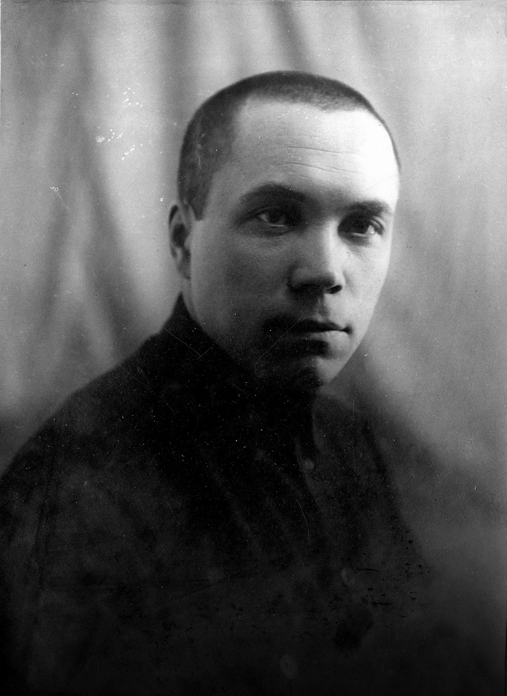 
<small>A.G. Beloborodov, member of the Revolutionary Military Council of the 9th Army.</small>

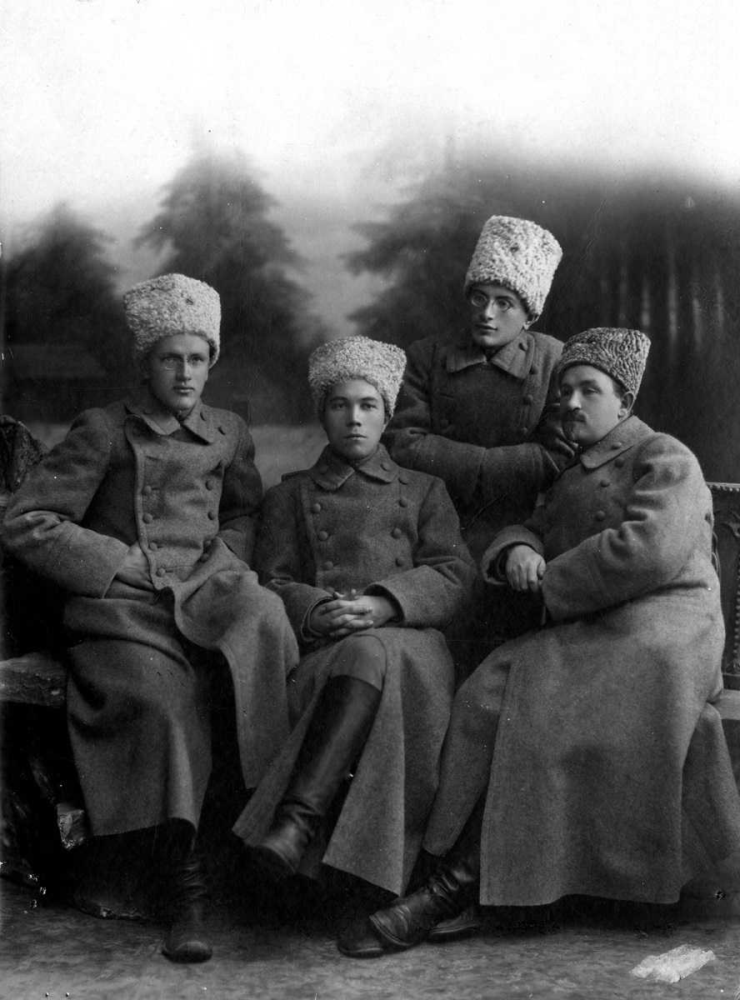 
<small>Group photograph, 1918.</small>

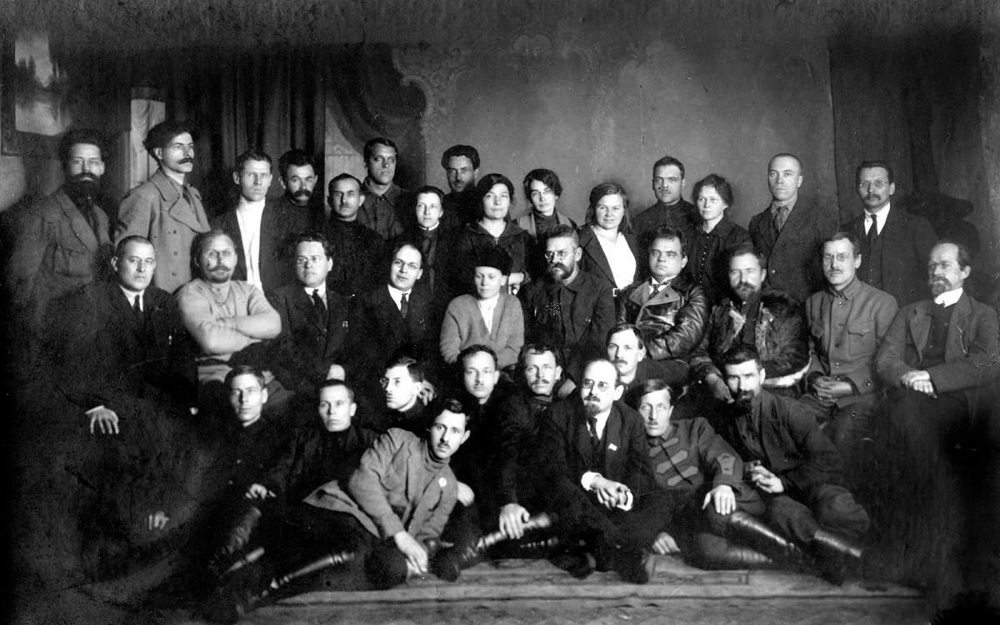 
<small>Group photograph, 1917.</small>

> After the dissolution of the Constituent Assembly, he worked in Yekaterinburg and was elected a member of the Regional Executive Committee by the III Regional Congress of Soviets of the Ural Region. In the Regional Executive Committee, he served first as Deputy Chairman, then as Chairman. After the Red Army retreated from the Urals, he worked first in Perm, then in Vyatka. He was elected a member of the Central Committee by the VIII Congress of the RCP. In April 1919, the Council of Defence dispatched him to the Southern Front, to the area of the Vyoshenskaya Uprising, as plenipotentiary. Returning from the front in July 1919, he was appointed Deputy Chief of the Political Directorate of the Revolutionary Military Council of the Republic. In October 1919, he was appointed a member of the Revolutionary Military Council of the IX Army of the South-Eastern (later Caucasian) Front.  
> Upon the entry of the IX Army into the Kuban, he was appointed a member of the Kuban Revolutionary Committee. In August 1920, he was appointed Deputy Chairman of the Revolutionary Council of the Caucasian Labour Army, then Chairman of the Regional Economic Council of the South-East. In October 1921, he was transferred to Moscow and then appointed Deputy People's Commissar of Internal Affairs. On July 7, 1923, he was appointed People's Commissar of Internal Affairs.  
> *(Beloborodov Alexander Grigorievich (autobiography) // Figures of the USSR and the Revolutionary Movement in Russia. Granat Encyclopedic Dictionary. – M.: Soviet Encyclopedia, 1989. Pp. 360)*

While serving as Chairman of the Executive Committee of the Ural Regional Soviet, Alexander Georgievich had daily to address a multitude of political, organizational, financial, and military issues requiring immediate and clear decisions. One of the first tasks was rendering assistance to the newly formed Red Army.

Here is one of the many telegrams from Beloborodov, characteristic of his style:

> Urgent. Military. February 27, 1918.  
> Pskov has fallen, the Germans are near Petrograd. Their victory means the death of the revolution. Immediately organize detachments of the best fighting forces, provide them with all necessities — warm clothing, footwear, undergarments, and provisions — by means of requisitions. Levy ruthless taxes on the local bourgeoisie for the creation of the Red Army fund. Telegraph the sums collected to the Regional Soviet no later than March 2. Shoot those who resist on the spot. Leave only the most essential number of fighting forces for the protection of the Soviets.  
> Send the detachments to Yekaterinburg, reporting their numbers by telegraph; if there are no weapons, send them without.  
> Regional Soviet. Chairman Beloborodov.  
> *(State Archive of Perm Krai F.R-3 Op.8 D.11. L. 9. Beloborodov Alexander Georgievich.)*

Beloborodov, like many members of the Ural party organization, sided with the Left Communists during the Civil War, who opposed signing a separate peace with Germany. This undoubtedly influenced the policies of the Ural Regional Soviet, including in the matter of army formation. The Ural "leftists" gravitated towards volunteer detachments instead of regular troops, as recalled by Isaiya Rodzinsky, a member of the collegium of the Ural Regional Cheka in 1918:

> They believed, as all leftists did, that the peasantry could not be fully trusted, that such a peasant army would be dangerous. Therefore, volunteer detachments were preferred. Hence the difficulties of the situation in the Urals. When, instead of organizing, say, regular units and normal mobilization, the leadership still leaned more towards volunteer detachments. And nothing came of it, by the way.  
> And by the time of the Czechoslovak offensive, it turned out that we had nothing which to fight, after all.  
> *(RGAFC F. 1. Item No. 12125. Recording of a conversation with I.I. Rodzinsky about the execution of the Tsar's family. Radio Committee, May 15, 1964.)*

The financial question was also acutely on the agenda. The issuance of local currency in the Urals in 1918 was prompted by an acute need for small change, which arrived from the centre with great interruptions during the Civil War.

The Ural Regional Credit Notes were double-sided, printed on thick paper. The obverse bore the inscription: *"Workers' and Peasants' Government of the Russian Federative Soviet Republic. Yekaterinburg Branch of the State Bank. Regional Credit Note of the Urals, Emergency Issue."* Below were the facsimile signatures of the Chairman of the Regional Committee of Soviets of the Urals, A.G. Beloborodov, the Commissar of Finance, F.F. Syromolotov, as well as the signatures of the manager of the Yekaterinburg State Bank Branch, the commissar, and the cashier.

On the reverse side of the Ural Regional Soviet's money, the terms of their issue were placed: *"1) The Regional Credit Notes of the Urals, emergency issue, are issued by decree of the Regional Council of Workers' and Peasants' Deputies on the basis of credits approved by the Council of People's Commissars of the Workers' and Peasants' Government of the Russian Federative Republic of Soviets. 2) The Regional Credit Notes of the Urals are secured by all the assets of the Russian Federative Republic of Soviets and are accepted for all payments on par with State Credit Notes. 3) Those guilty of counterfeiting Regional Credit Notes shall be brought before the Court of the Revolutionary Tribunal."*

The design of the banknotes is of interest. The one-rouble notes featured images of workers' and peasants' tools, while the reverse of the five-rouble note featured an image of a Red Army soldier and a sailor. The money served as a kind of visual agitation for Soviet power.

Isaiya Rodzinsky, in his 1964 interview for the Radio Committee, gave an interesting description of the working style of the Ural Regional Soviet Executive Committee and the views of its members, including Beloborodov:

> It must be said that the leadership was dominated by Left Communists, by the left. Beloborodov, Safarov, Nikolai Tolmachyov, Evgeny Preobrazhensky – all were leftists. [...] By the way, as I began to speak about the state of the party organization, this leftism had a very strong impact on relations with the centre, because the constructive measures planned by the government were not being implemented there.  
> So power there was exercised directly by the Ural Regional Council? Yes, it was called the Executive Committee of the Soviets of the Urals. Its chairman at that time was Beloborodov. And it was like this: all his paperwork was contained in a little pocket notebook. Wherever he appeared, he would immediately raise an issue, resolve it, and things would proceed. Everything was done on the fly. Generally speaking, though, the leadership was strong, considering the personalities who sat there.  
> *(RGAFC F. 1. Item No. 12125. Recording of a conversation with I.I. Rodzinsky about the execution of the Tsar's family. Radio Committee, May 15, 1964.)*

After the capture of Yekaterinburg by the troops of the Czechoslovak Legion, Beloborodov worked in Perm, and then in Vyatka. In April 1919, he was dispatched to the Southern Front. Alexander Georgievich set off for the Don with a Mandate signed by V.I. Lenin.

> This is given by the Council of Workers' and Peasants' Defence of the R.S.F.S.R. to Comrade Beloborodov, Extraordinary Plenipotentiary of the Council of Defence, in that he is being dispatched to the Southern Front to investigate the causes of the Cossack uprising on the Don, the sluggishness of its liquidation, and to take all necessary measures to accelerate the liquidation of this uprising.  
> In view of this, Comrade Beloborodov is granted the right to demand from all officials, without exception, both military and other departments, reports and explanations on the activities of the institutions subordinate to them, to conduct, directly or through persons authorized by Comrade Beloborodov, all manner of inspections, and, in agreement with the Revolutionary Military Council of the Republic, to remove and bring to trial before the Revolutionary Tribunal all officials.  
> Comrade Beloborodov is charged with taking all necessary measures to enhance the delivery of foodstuffs to the R.S.F.S.R.  
> Comrade Beloborodov is also charged to enter into full contact with the detachments sent by the People's Commissariat of Agriculture to organize the resettlement of workers and peasants in the Donetsk region, and to take all necessary measures for the successful resolution of this issue. He is granted the right to demand from the relevant Soviet institutions and officials all materials necessary for establishing the availability of free lands and the swift organization of land departments.  
> All orders of Comrade Beloborodov concerning the assignments entrusted to him are subject to unconditional execution.  
> All Soviet institutions are instructed to render Comrade Beloborodov every assistance in the performance of his duties and the specially assigned tasks.  
> Persons who offer resistance to anything set forth in this mandate shall be held accountable and subjected to the Court of the Revolutionary Tribunal.  
> *(Mandate of A.G. Beloborodov. April 21, 1919 // Nekrasov V.F. Thirteen Iron People's Commissars – M.: Versty, State Firm Poligrafresursy, 1995. Pp. 101-102.)*

## Romanovs in Yekaterinburg

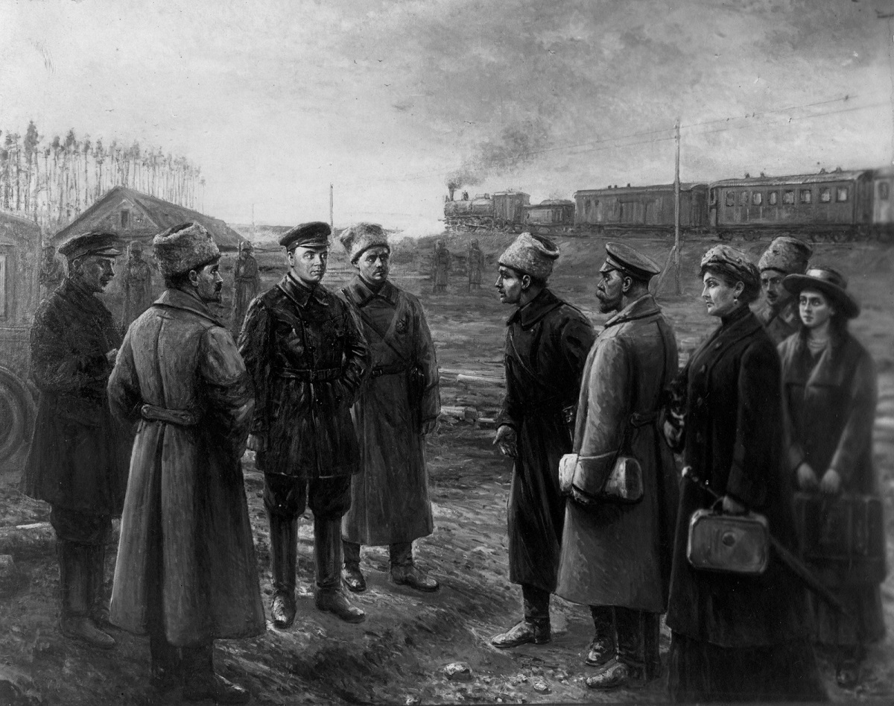 
<small>The handover of the imperial family to the Ural Regional Soviet at a Yekaterinburg station. Painting.</small>

As chairman of the Executive Committee of the Ural Regional Soviet, Alexander Georgievich Beloborodov played a central role in the fate of the last tsar, Nikolai II. On 9 April 1918, Beloborodov received a telegram signed by the Chairman of the Central Executive Committee, Yakov Mikhailovich Sverdlov, which was:

> Dear comrades!  
> Today, I informed you of Chairman Yakovlev`s arrival. We instructed him to transport Nikolai II to the Urals. Our position is that he should be kept in Yekaterinburg for now. Decide for yourself whether to keep him in prison or house him in a suitable mansion. No one is to be removed from Yekaterinburg without our direct instructions. Yakovlev's task is to bring Nikolai II to Yekaterinburg alive and hand him over either to Chairman Beloborodov or to Goloshchekin. Yakovlev has been given the most precise and detailed instructions. Take all necessary measures and coordinate the arrangements with Yakovlev.  
> With comradely greetings,  
> Yakov Sverdlov  
> *(State Archive of the Russian Federation [GARF]. F. 601. Op. 2. D. 33. L. 1. Letter from the Chairman of the All-Russian Central Executive Committee, Yakov Mikhailovich Sverdlov, to the Regional Ural Soviet on the transfer of the imperial family to Yekaterinburg.)*

On 30 April 1918, at 8.30 a.m., the special train of Commissar V. Yakovleva and the imperial family (Nikolai Alexandrovich, Alexandra Feodorovna and their daughter Maria) arrived at Yekaterinburg I station from Tyumen. Three hours later, on the instructions of the Ural Soviet commissars, the train was sent back and soon arrived at Yekaterinburg III (Tovarnaya) station, where the Romanovs were handed over to the Ural Soviet.

Alexander Beloborodov's memoirs of the "Yekaterinburg days of N. Romanov" have been preserved:

> At the end of February, the Presidium of the Regional Council repeatedly discussed the issue of former tsar Nikolai Romanov in Tobolsk. It was recognized that Nikolai Romanov's escape was possible, since the guards formed under Kerensky did not inspire confidence; the absence of Soviet power in provincial Tobolsk made it possible for any conspiracy to be organised for the kidnapping if the Romanovs. The Presidium recognized the need to send special authorized people to Tobolsk.  
> <…>  
> Emissaries were sent to Tobolsk with the task of finding out the situation and the possibility of entering the house where Nikolai Romanov was living.  
> Boris Vladimirovich Didkovsky supervised the operation. After my return, the matter remained in his hands.  
> In particular, Zaslavsky, an old Party worker formerly based in Nadezhdinsk, was dispatched shortly before Yakovlev's arrival.  
> In late March or early April, Vasily Vasilyevich Yakovlev, the commissar of All-Russian Central Executive Committee (VTsIK), and the Council of People's Commissars, arrived in Yekaterinburg and presented the mandate of the All-Russian Central Executive Committee (VTsIK) and the Sovnarkom to instruct him to take Nikolai Romanov and his family out of Tobolsk. In addition, Yakovlev also handed over a letter from Yakov Mikhailovich Sverdlov, which stated that Nikolai Romanov was to be [crossed out] placed under responsibility of Beloborodov and Goloshchekin.  
> <...>  
> Approximately at one o'clock in the afternoon.... [on April 30], members of the Presidium — Beloborodov, Didkovsky and Goloshchekin — left by car for Yekaterinburg-Tovarnaya station. They were going to receive the arriving members of the imperial family.  
> When they arrived at the station, Beloborodov and Didkovsky entered Yakovlev's carriage. Beloborodov signed a receipt confirming the transfer of the Romanovs. (At the same time he made mistakes: instead of "accepted," he wrote "received," instead of «velikaya knyazhna,» (daughter of the Imperial family) he wrote "velikaya knyaginya» (wife of a Grand Duke).  
> <...>  
> The Romanovs were taken to the Beloborodov mansion immediately after their arrival. After that, Beloborodov sent a telegram to Sverdlov informing him about their accommodation.  
> *(Collection of written sources Of the Sverdlovsk Regional Museum of Local History [SOKM]. F. 5. Op. 2. D 1. l. 27, 28, 34, 36. From the memoirs of A.G. Beloborodov. 1932)*

On 30 April 1918, Beloborodov sent a telegram to two addressees, Vladimir Ilyich Lenin and Yakov Mikhailovich Sverdlov:

> TODAY, APRIL 30, AT 11 A.M. IN PETROGRAD, I RECEIVED FROM THE COMMISSAR YAKOVLEV THE FORMER TSAR NIKOLAI ROMANOV, THE FORMER TSARINA ALEXANDRA AND THEIR DAUGHTER MARIA NIKOLAEVNA. PERIOD. THEY ARE ALL PLACED IN A MANSION GUARDED BY A GUARD. PERIOD. YOUR REQUESTS FOR CLARIFICATION TELEGRAPH TO ME THE CHAIRMAN OF THE URAL REGIONAL COUNCIL BELOBORODOV.  
> *(State Archive of the Russian Federation (GARF) F. 601. Op. 2. D. 27. L. 6.)*

The conditions in the House of Special Purpose, known as the Ipatiev House, were much worse than those in Tobolsk.

> The move from Tobolsk to Yekaterinburg undoubtedly had a negative effect on the "highest personages". Firstly, the Yekaterinburg regime was organized along prison lines (a fence in front of the windows was high enough, so that only a strip of sky was visible. Daily walks were limited to one hour. Guards were stationed inside the building in rooms adjacent to those occupied by the prisoners). Secondly, fewer people were allowed to remain with the prisoners in Tobolsk and provide companionship to the Imperial Family. Thirdly, rations were reduced (500 rubles per person were issued in Yekaterinburg). Fourthly, correspondence was controlled (letters received from outside and were sent by prisoners were reviewed by me). Fifthly, all visits from outsiders were terminated, and so forth.  
> *(From the memories of the chairman of the Ural Regional Soviet A.G. Beloborodov // Archive of the modern history of Russia. Series "Publications". Vol. III. The sorrowful path of the Romanovs (1917-1918). The death of the imperial family. Collection of documents and materials. Moscow: ROSSPEN, 2001. p. 245.)*

On May 29, martial law was imposed in Yekaterinburg and in a significant part of the Ural region, in connection with the outbreak of military operations by Red Army units against the Czechoslovak Legions. On July 8, units of the Czechoslovak Corps and Orenburg Cossacks under the command of Colonel Stanislaw Nikolaevich Wojciechowski launched an attack on Yekaterinburg.

On July 16, according to the memoirs of Mikhail Alexandrovich Medvedev (Kudrin), in the building of the Ural Regional Extraordinary Commission, located in an American hotel in Yekaterinburg, the fate of the Romanovs was being determined:

> ...I saw comrades I knew in the room: Chairman of the Soviet of Deputies Alexander Georgievich Beloborodov, Chairman of the Regional Bolshevik Party Committee Georgy Safarov, Yekaterinburg Military Commissar Filipp Goloshchekin, Council member Pyotr Lazarevich Voykov, Сhairman of the Regional Extraordinary Commission Vladimir Gorin, Isaiah Idelevich (Ilyich) Rodzinsky (now a personal retiree, lives in Moscow), and the commandant of the House of Special Purpose (Ipatiev House) Yakov Mikhailovich Yurovsky.  
> <…>  
> After Goloshchekin's report, Safarov asked the military commissar how many days he thought Yekaterinburg would last. Goloshchekin replied that the situation was critical – poorly armed Red Army volunteer detachments were retreating and that Yekaterinburg would fall within three days or five at most. A heavy silence fell. Everyone understood that evacuating the imperial family from the city not only to Moscow but even to the North would provide the monarchists a long-awaited opportunity to kidnap the tsar.  
> <…>  
> After discussing all the circumstances, we decided to carry out two operations that same night: to eliminate two underground monarchist officer organisations capable of betraying the city defenders (Chekist Isay Rodzinsky was assigned to this operation), and to execute the Romanov imperial family.  
> *(RGASPI F. 588. Op. 3. D. 12. L. 41-43, 45, 46. Mikhail Alexandrovich Medvedev (Kudrin). The execution of the Romanov imperial family in Yekaterinburg on the night of July 17, 1918, 1963.)*

On July 16, after a meeting of Commissars Goloshchekin and Safarov, an urgent telegram was transmitted directly to the Chairman of the Petrograd Soviet Grigory Evseevich Zinoviev:

> MOSCOW, THE KREMLIN SENT THE FOLLOWING MESSAGE TO SVERDLOV AND LENIN DIRECTLY FROM YEKATERINBURG: INFORM MOSCOW THAT THE COURT-MARTIAL AGREED WITH FILIPPOV COULD NOT BE DELAYED. IF YOUR VIEWS ARE OPPOSED, INFORM GOLOSHCHEKIN AND SAFAROV IMMEDIATELY, WITHOUT DELAY, COMMUNICATE WITH YEKATERINBURG DIRECTLY.  
> ZINOVIEV  
> *(State Archive of the Russian Federation (GARF) F. R-130. Op. 2. D. 653. L. 12.)*

According to the testimony of Yakov Mikhailovich Yurovsky, a telegram approving the decision of the Council Of People’s Commissars (Sovnarkom) and the All-Russian Central Executive Committee (VTsIK) was sent the same evening via Perm:

> 16.VII a telegram was received from Perm in a coded language, containing an order for the execution of the Romanovs. At 6 p.m. on the same day Filip [Goloshchekin] ordered that the directive be carried out.  
> *(Russian State Archive of Socio-Political History (RGASPI) F. 588. Op. 3. D. 9. L. 1. A record of the memoirs of the commandant of the Ipatiev house, Yakov Mikhailovich Yurovsky, concerning the execution of the Romanovs, recorded by Mikhail Nikolayevich Pokrovsky.)*

On the night of 16-17 July 1918, Nikolai II, his family and inner circle were murdered in the Ipatiev house in Yekaterinburg.

Immediately after the execution, on the morning of 17 July, the Presidium of the Ural Regional Soviet sent a telegram to Moscow reporting that the tsar had been executed and his wife and son had been sent to a safe place. But in the evening of the same day, Alexander Beloborodov sent a ciphered telegram with the following content:

> Tell Sverdlov that the whole family shared the same fate as the former tsar. Officially, it will be reported that family died during the evacuation.  
> *(State Archive of the Russian Federation (GARF) F. 1837. Op. 1. D. 51. L. 1.)*

A copy of the telegraph text was lost at the Yekaterinburg telegraph office, and it was later captured by White Army forces, decoded, and first published in N.A. Sokolov's book "The Murder of the Imperial Family."

## Socialist construction

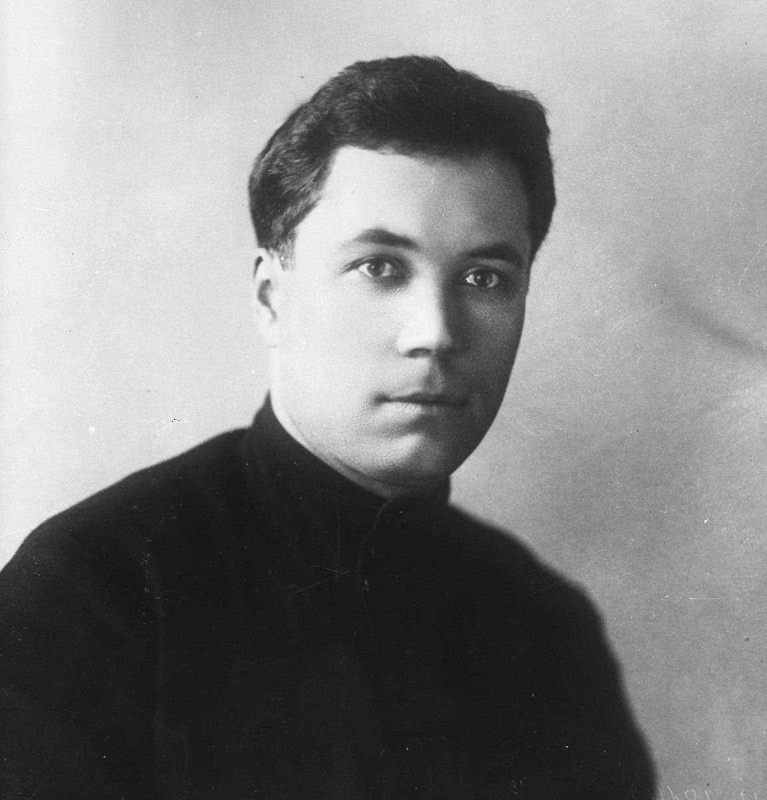 
<small>A.G. Beloborodov in the 1920s.</small>

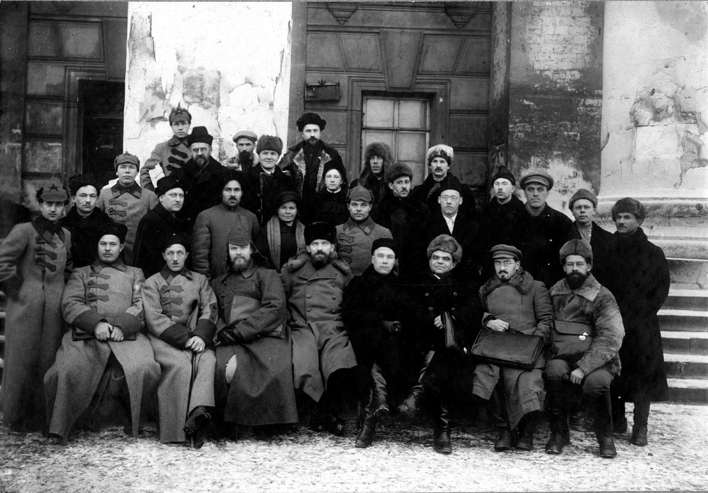 
<small>Delegates to a Party Congress.</small>

In October 1921, A.G. Beloborodov was promoted: transferred to Moscow and appointed Deputy People's Commissar of Internal Affairs. On July 7, 1923, he became People's Commissar of Internal Affairs. This was the highest point in his career — but politics would soon block his path.

He worked in the NKVD of the RSFSR longer than anywhere else — seven years, from 1921 to 1927. Conditions in the NKVD in the 1920s were poor: the police were moved to local budgets, the profession lost its prestige, staff turnover was high, and many positions were unfilled. Between 1921 and 1926, the number of police officers fell sixfold. After Dzerzhinsky left the NKVD, some even wanted to abolish the commissariat — give some functions to economic agencies, prisons to the courts, and police and criminal investigation to the OGPU. Beloborodov had to fight to keep his department intact.

From A.G. Beloborodov's report at the meeting of People's Commissars of Internal Affairs of the union republics, June 14, 1924:

> The problem is that the police are bad. But handing them over to the OGPU won't make them good. What's wrong? The higher political and Soviet bodies haven't paid enough attention to the police. The police don't have enough political workers — nothing like the GPU. And the budget is miserable…  
> There are two important reasons not to transfer the police to the OGPU.  
> First: national conditions. In many republics, locals see the police as their protectors, as the face of Soviet power. They often judge Soviet power by the police. But they see the GPU as a punitive body.  
> Second: transferring 70,000 policemen to the OGPU would give them a sense of special rights — and that would not improve their work.  
> In short, the NKVD's problems come from the terrible conditions it was placed in.  
> *(Beloborodov, Alexander Georgievich. 1923-1927 // Nekrasov, V.F. Thirteen Iron Commissars – Moscow: Versty, State Firm Poligrafresursy, 1995. p. 113.)*

These conditions affected the quality of work — and Beloborodov himself gave a harsh assessment in 1926:

> I've worked in the Commissariat for six years, and my impression is dreadful. I've worked in other institutions since the revolution began, but I've never seen such an incompetent, inefficient office. They blame objective reasons and low pay — but that doesn't explain the low productivity here.  
> We have five hundred employees on salary, yet they can't produce a properly drafted document for the Commissar. I constantly have to edit, dictate again, or rewrite resolutions.  
> *(Beloborodov, Alexander Georgievich. 1923-1927 // Nekrasov, V.F. Thirteen Iron Commissars – Moscow: Versty, State Firm Poligrafresursy, 1995. p. 108.)*

Alexander Georgievich took part in All-Union and All-Russian Congresses of Soviets, and was a delegate to the VI, VII–X, XII, and XIII Party Congresses.

In the 1920s, Beloborodov moved closer to Leon Trotsky and actively joined the internal party struggle on the side of the Left Opposition. On October 11, 1923, he signed the "Statement of the 46" to the Politburo, adding a postscript:

> Disagreeing with some points of this letter about the causes of the current situation, but believing that the party has faced issues that can't be solved by old methods — I fully subscribe to its final conclusion.  
> *(To the Politburo of the Central Committee of the RCP // Trotsky's Archive. The Communist Opposition in the USSR. 1923-1927. Vol. 1. Moscow: Terra, 1990. p. 86.)*

The signatories were worried about a threat to party unity and internal democracy:

> …the party is ceasing to be alive and active, connected to reality by thousands of threads. Instead, we see an almost undisguised division into a secretarial hierarchy and the laity, into professionals and those who don't take part in public life.  
> *(To the Politburo of the Central Committee of the RCP // Trotsky's Archive. The Communist Opposition in the USSR. 1923-1927. Vol. 1. Moscow: Terra, 1990. p. 84.)*

On May 25, 1927, another letter was sent to the Central Central Committee — the "Statement of the 83." It criticized Soviet foreign policy, the idea of socialism in one country, and the lack of internal party democracy. Beloborodov was among the signatories.

In November 1927, a group of Trotsky's closest associates — including Beloborodov — was sent to the Urals before the 15th Congress. Many of them were well known there and still had influence. They were ready to lose party membership and high positions. After this trip, Beloborodov was expelled from the party and lost his post as People's Commissar of Internal Affairs.

> **Extract from Protocol No. 95**  
> Meeting of the Party Collegium of the Ural Regional Control Commission, All-Union Communist Party (Bolsheviks)  
> November 12, 1927  
> 
> **LISTEN:**  
> On the anti-party behavior of A.G. Beloborodov (People's Commissar of Internal Affairs).  
> Summoned by newspaper to the Regional Control Commission, he did not appear.  
> 
> **RESOLVED:**  
> Based on the following facts:  
> a) Beloborodov arrived in the Urals but did not show up in any party or Soviet organization — meaning he came to conduct anti-party work.  
> b) On November 8, at a Sverdlovsk party activists' meeting, he was given the floor but began accusing party members and the meeting itself. He was then deprived of the floor. He threatened to appeal to non-party workers. When removed, he shouted to Red Army soldiers: "Do you know whom you're guarding? You're serving the wrong class. You're serving Ustyalov."  
> c) On November 10, Beloborodov appeared at a meeting of the party collective at the Verkhne-Isetsky plant with a small group of local oppositionists. The meeting did not let him in. Afterwards, he gathered 15–20 workers (some non-party) — first in the corridor, then outside near the plant. From 7 p.m. to 10 p.m., he conducted anti-party agitation, slandering the party and its leaders, saying things like: "Stalin, Bukharin, Rykov, Kalinin have deceived the workers. The Stalinist faction has made a deal with the right Socialist Revolutionaries. They will rob the working class and the peasantry. The party hides everything — for example, the Politburo decided to pay military debts to France and Germany. Your wages have dropped 20%. We want to tell you the truth, but we're not allowed."  
> *(CDOOSO F. 424 In. 2 F. 774. S. 2-3. Extract from Protocol No. 95 of the meeting of the Party Collegium of the Ural Regional Control Commission of the All-Union Communist Party (Bolsheviks).)*

By January 18, 1928, 30 people — including Beloborodov — had been exiled from Moscow for anti-Soviet activities. He was sent to the village of Ust-Kulom in the Komi Republic. Trotsky noted in a letter how remote it was:

> Ust-Kulom is a terrible hole, much worse than your Irbit. You can barely get kerosene there.  
> *(Letter to Brover, May 26, 1928 // L.D. Trotsky, Letters from Exile — Moscow: Direct-Media, 2015. p. 133.)*

In exile, oppositionists faced a lack of money and medical help. They had to find jobs — the state allowance wasn't enough, and there was no other support.

From Trotsky's letter to Beloborodov, March 17, 1928:

> I'm sorry you have to spend so much time on clerical work. You are one of the youngest among us. This forced removal from real work should be used for theoretical self-education — but the office takes your free time. That's a shame. If I were you, I'd complain to the Executive Committee or the Party Committee: at the very least, ban smoking in the workplace during working hours.  
> *(Trotsky, L.D. Letters from Exile — Moscow: Direct-Media, 2015. p. 38.)*

Beloborodov saw himself as one of the "irreconcilable" Bolshevik-Leninists who would not tolerate Stalin's policies — even after the leftward turn in the late 1920s. He defended his position in letters, criticizing those who wanted to compromise:

> Most ridiculous thing is repenting for having "overestimated" the danger. As if there's a yardstick for measuring it. We were obliged to fight as Bolsheviks. And our assessment has been fully justified — by the grain crisis, the commodity shortage, the sowing campaign, the internal party situation, etc.  
> *(Letter to Beloborodov, May 23, 1928 // Trotsky, L.D. Letters from Exile — Moscow: Direct-Media, 2015. p. 103.)*

After Trotsky was exiled to Turkey in 1929, there was no one left to reconcile the orthodox and the moderate factions. Eventually, the leaders of the "irreconcilables" gave in. Two years after his exile began, Beloborodov submitted a statement to the Central Committee admitting his errors.

On May 8, 1930, the Party Collegium reinstated him as a party member — with a break in seniority from November 1927 to May 1930. In 1930, he was sent to Rostov-on-Don, where he worked in the USSR Procurement Committee. In his last years before arrest, he was Deputy Representative for the Azov-Black Sea Territory. More about this period can be found in the chapter "Behind Closed Doors".

In 1932, Beloborodov began writing his memoirs — about his childhood, work at the Nadezhdinsk Factory, and the Romanovs in Yekaterinburg. The notebook was saved by his daughter and later transferred to the Sverdlovsk Regional Museum of Local Lore. Excerpts are presented in several sections of the site.

## Behind Closed Doors

Throughout many years, through ups and downs, Alexander Georgievich was always accompanied by his main comrade-in-arms, wife, and friend — Franciska Viktorovna Yablonskaya. They met on the fronts of the Civil War, where she served as an army political worker.

Shared views and dreams brought them together. They married, and on May 30, 1921, their only daughter, Alexandra, was born.

Franciska Viktorovna wasn't just a homemaker. She was also a comrade-in-arms, as active in the Left Opposition as her husband. She was friends with Trotsky's family, especially his wife Natalia Sedova, and often visited them. She kept supporting them openly even during times of disgrace and persecution.

From the memoirs of N.I. Sedova (Trotsky's wife):

> Past midnight we went to sleep. After the anxieties of the previous days, we slept until 11 a.m. No phone calls. Everything was quiet. We had just finished breakfast when the doorbell rang — F.V. Beloborodova arrived… then M.M. Ioffe. Another ring — and the apartment filled with GPU agents, both plainclothes and uniformed. They handed L.D. an arrest warrant and ordered him to leave immediately for Alma-Ata under guard.
>
> Seeing he was wearing house slippers, they found his boots and put them on him. They found his fur coat and hat and put them on him. L.D. refused to go. So they picked him up. We hurried after them. I threw on a coat and boots… The door slammed shut behind me. There was noise outside. Shouting, I stopped the convoy carrying L.D. down the stairs and demanded that the sons be let through: my older son had to go with us into exile. The door swung open, the sons rushed out, and so did our two guests, Beloborodova and Ioffe. They all forced their way out. Seryozha used his athlete's strength. Going down the stairs, Leva rang every doorbell and shouted: "They're taking Comrade Trotsky!" Frightened faces appeared in doorways and on the stairs. Only top Soviet officials live in this building. The car was packed tight. Seryozha's legs barely fit. Beloborodova was with us too. We drove through the streets of Moscow.
>
> *(Chapter XLIII. Exile // Trotsky, L.D. My Life: An Attempt at an Autobiography. — Moscow: Panorama, 1991. p. 514.)*

When A.G. Beloborodov was sent into exile, Franciska Viktorovna stayed true to their shared beliefs. She never thought of leaving him. Whenever she could, she and her daughter Alexandra visited him in Ust-Kulom. And when he was sent to Rostov in 1930, she followed him without hesitation.

In 1936, a few days after Alexander Georgievich was arrested, Franciska Viktorovna was also arrested. She was executed on April 15, 1938, two months after her husband's death.

After her parents died, Alexandra was taken in by her aunt Lyubov, Franciska's sister. Asya (as she was called) was allowed to live and study in Moscow. She graduated from the First Moscow Medical Institute, but right after graduation she was sent to Sverdlovsk.

Alexandra Alexandrovna dedicated her life to medicine. She worked as chief physician of the Railway Sanitary-Epidemiological Station and as head of the Railway District Health Department. At Central Hospital No. 3, she ran the therapeutic shop-floor service. From 1975 to 1983, she was deputy chief physician for outpatient care at Hospital No. 32. From 1983 to 1998, she headed the medical statistics office at City Central Hospital No. 3.

Colleagues at City Central Hospital No. 3 remembered her as a strong-willed person, fully devoted to her work:

> "Alexandra Alexandrovna had a tough but fair character," they said. "She was a born leader and an unquestioned authority, not just in statistics."

They also remembered her as a great lover of art and literature, especially the classics. She worked at the hospital for 23 years and retired at age 79.

Alexandra Alexandrovna also made a significant contribution to the Sverdlovsk Regional Museum of Local Lore. Between 1988 and 2003, she preserved and donated more than 70 items, including unique belongings that had belonged to her parents.

From Alexandra Beloborodova-Yablonskaya's memoirs about her family:

> I don't remember much about our life in Moscow when my father worked at the People's Commissariat of Internal Affairs (I was 2–6 years old). I remember we lived at 3 Granovskogo Street, apt. 62. I accidentally remember the phone number: 19939.
>
> My parents were very busy. Father spent most of his time at work. His few free hours he gave to me — taking me to the parade on Red Square, sometimes for walks, buying toys and books.
>
> I remember father's study had large bookcases and many books, which I now understand were on political topics. We lived very modestly. The party maximum was 225 rubles — the norm for communists back then.
>
> I recall that guests would sometimes come over, but I don't remember friends well. Vivid personalities like Ivan Skvortsov-Stepanov, Ivan Smilga, and Artashes Khalatov stayed in my memory.
>
> Father didn't have a formal completed education. His deep knowledge came from persistent effort and self-education throughout his life. He was a well-rounded man.
>
> I remember the Rostov-on-Don period better — 1931–1936. Father worked a lot, often bringing papers home in his briefcase and working in the evenings. He kept studying — higher mathematics and English.
>
> Thanks to his broad outlook, he was always a demanding but kind mentor to me in school subjects, especially literature. I remember his passion for Pushkin. He not only knew Pushkin's works perfectly but also the critical literature of that time. He highly valued Pasternak.
>
> My parents were strict with me about discipline, diligence, and hard work. All my moral foundations were laid in childhood, because after 15 I lived almost independently. Father was always impeccably honest. He never used his position for personal gain. He didn't care about fancy living conditions.
>
> Mother was more sociable and open than father. He was somewhat reserved and stern. The family atmosphere was friendly, respectful, and harmonious. I was never punished.
>
> Raising me in the spirit of Soviet patriotism, my parents were models of devotion to the party cause. I remember father carefully kept a personal note from V.I. Lenin — a small pencil-written scrap of paper. I don't remember exactly what it said; it was a short business note about discussing an important issue.
>
> In Rostov, Moscow theaters and famous performers often toured. My parents took me to shows and concerts. I remember creative evenings of Mikhail Koltsov and Mikhail Zoshchenko, concerts by L. Oistrakh, E. Petri, and other musicians.
>
> Among my relatives, I want to tell about my mother's sisters. An outstanding personality was Lyubov Viktorovna Yablonskaya — a famous metallurgical engineer. She helped build and run metallurgical plants in Kerch and Zhdanov, then worked at the People's Commissariat of Ferrous Metallurgy, and later at the journal "Stal". She was energetic, strong-willed, erudite, and passionate about her work. She was awarded four orders, including the Order of Lenin. Her only son, Lev — my age and close friend — volunteered for the front and died in the first months of the war.
>
> My mother's second sister, Polina Viktorovna Yablonskaya (born 1905), worked as an economist. She was kind-hearted and responsive. I had a very warm relationship with her.
>
> In 1936, my parents became victims of lawlessness and tyranny, but for me they will always be models of Leninist Bolsheviks, selflessly devoted to the cause of the revolution. In 1958, they were posthumously rehabilitated, and in October 1962, their party membership rights were posthumously restored.
>
> The changes in public opinion in our country — as historical truth about true revolutionaries and active workers of the first years of Soviet power is being restored — bring me great moral satisfaction.
>
> *(Beloborodov, Alexander Georgievich. 1923–1927 // Nekrasov, V.F. Thirteen Iron Commissars. — Moscow: Versty, State Firm Poligrafresursy, 1995. pp. 122–125.)*

Alexandra Alexandrovna Beloborodova-Yablonskaya died on January 21, 2005. She is buried in the Northern Cemetery of Yekaterinburg.

## Reading Circle

Books from childhood played a large role in the formation of Alexander Georgievich Beloborodov's personality. Thanks to his love of reading, from a young age he "stood out among other comrades because of his broad intellectual horizons." After finishing Alexandrovskoye Primary School in 1903, he did not stop self-education even while in Perm prison:

> In prison, he read a lot and engaged in self-education, somewhat supplementing the knowledge that primary school had given.

After his release, Alexander continued studying the works of the classics of social-democratic thought. Among them were Marx, Engels, Lassalle, Kautsky, and others. To supplement his knowledge, besides books, more educated comrades who had gymnasium or university education also helped him:

> "Alexander Georgievich lived in difficult conditions, in a damp little room, devoted much time to self-education, read a lot. After all, he had received no education at that time. He often came to A.A. Kuzmin and stayed for a long time, conversing with my husband. Alexander Alexandrovich never regretted the time spent on these conversations, patiently discussing with him questions of current political life."

Beloborodov's daughter, Alexandra Alexandrovna, recalled that her father retained a lively interest and thirst for new knowledge until the end of his days:

> My father did not have a formal education; his profound knowledge was the result of persistent work, self-education throughout his life; he was a comprehensively educated person.
>
> …Father worked very hard, often brought papers in a briefcase, worked in the evening hours. He continued self-education — studied higher mathematics and the English language.
>
> Thanks to his broad horizons, he was always a demanding and benevolent mentor to me in all matters concerning school subjects. He was especially interested in literature. I remember very well his admiration for Pushkin. He knew not only his works perfectly but also the extensive critical literature of that time. He highly valued Pasternak.

For many years, Alexander Georgievich collected books for his library. These were mostly works on history and politics, as well as fiction:

> I remember large bookcases standing in my father's study; there were many books on political issues, as I now understand.

Part of them, miraculously preserved by Alexander Beloborodov's daughter — Alexandra Alexandrovna — was transferred to the Sverdlovsk Regional Museum of Local Lore.

## The End of Life: Investigation and Execution

In 1936, Alexander Beloborodov's life in Rostov-on-Don changed significantly. On August 11, the bureau of the Kirov District Committee of the VKP(b) excluded him from party membership on political charges.

The exclusion was based on his earlier participation in the Left Opposition. The bureau of the Kirov District Committee of the VKP(b) stated in its resolution of August 11, 1936:

> Beloborodov — an active Trotskyist and organizer of counter-revolutionary Trotskyist groupings.
>
> In 1924, he signed the "45" statement. In 1926–1927, he signed the "82" platform.
>
> In 1927, he belonged to the leadership of the Trotskyist-Zinovievist opposition bloc. He actively spoke in defense of the Trotskyist-Zinovievist opposition.
>
> As an active organizer, he was excluded from the ranks of the VKP(b). He was reinstated with a break in party seniority from November 1927 to May 1930 after submitting a statement of refusal.
>
> Beloborodov did not speak and did not help the party to expose enemies — Trotskyists and Zinovievists — during discussions of materials concerning the murder of Comrade Kirov at party meetings. He actively participated in counter-revolutionary work against the party together with them. He remained silent in party work all the time, lived covertly, and pursued a double-dealing policy toward the party.
>
> BELOBORODOV, as an unrepentant Trotskyist double-dealer, is to be EXPELLED from the ranks of the VKP(b).

After receiving such a characterization, Alexander Beloborodov did not remain free for long, and already on August 15, 1936, he was arrested by the NKVD.

During six months of interrogations and confrontations, Alexander Georgievich refused to admit guilt. This did not prevent investigators from preparing materials for future charges. For example, in the summary of N.I. Yezhov's report "On anti-Soviet Trotskyist and Right organisations," presented at the December Plenum of the Central Committee of the VKP(b) in 1936, we find accusations against the former People's Commissar of terrorist activity:

> About 200 members of a Trotskyist organisation headed by Beloborodov, Glebov-Avilov, Gordon, and others were arrested in the Azov-Black Sea region. Similarly to the West Siberian organisation, this organisation carried out significant subversive work at the most important industrial enterprises of the region, including defense enterprises. The organisation actively prepared a terrorist act against Comrade Stalin. It planned to carry it out during a regular vacation in Sochi.
>
> …The following testimonies of the most active participants of terrorist groups provide sufficient evidence of how serious the terrorist activity of the reserve center was.
>
> For example, the terrorist Dorofeev, arrested in the Azov-Black Sea region, gives the following testimony about the preparation of the murder of Comrade Stalin:
>
> "…At the beginning of 1935, after the murder of Kirov, Beloborodov cursed Dukat, saying that he had missed the opportunity to kill Stalin in Sochi. He told me that there were enough people, the opportunity was evident, but the matter was progressing slowly.
>
> Beloborodov assigned great importance to the murder of Kirov. He said that the very fact of a successful terrorist act would increase the number of supporters of terror and raise the activity of terroristically inclined elements.
>
> In 1935, the preparation of the murder of Stalin was carried out very actively by the organisation. In the summer, Dukat went to Sochi in order to track Stalin's route. If necessary, he was to summon militants from Rostov to commit the terrorist act.
>
> Before Dukat's departure, I met with him at Beloborodov's apartment, where Dukat, Yablonskaya, and I were present. Dukat told me that he had in Sochi a group of 5–7 persons from among the local residents. They were watching Stalin."

Investigators obtained detailed testimonies from Beloborodov only in 1937, in which he admitted guilt in counter-revolutionary Trotskyist terrorist activity. All three interrogations were typed on a typewriter without stenographic records. Kogan and Osinin conducted these interrogations. In 1940, they were sentenced to execution by the Military Collegium of the USSR Supreme Court for counter-revolutionary wrecking activity and falsification of investigative cases. A.G. Beloborodov was not acquainted with the materials of the preliminary investigation.

On May 26, 1937, N.I. Yezhov sent I.V. Stalin a copy of Beloborodov's statement about persons sharing Trotskyist views. Stalin was dissatisfied with these testimonies and left a note on the first page:

> To Yezhov. One might think that prison for Beloborodov has become a platform for delivering speeches and statements about all sorts of persons. But not about himself. Isn't it time to pressure this gentleman and force him to tell about his dirty deeds? Where is he sitting — in prison or a hotel?

On February 8, 1938, Alexander Beloborodov was sentenced to capital punishment — execution by the Military Collegium of the Supreme Court. The sentence was carried out the next day. On April 15, 1938, Beloborodov's wife — Franciska Viktorovna Yablonskaya — was also executed.

Twenty years later, in 1958, Alexander Georgievich Beloborodov was posthumously rehabilitated by the decision of the Military Collegium of the USSR Supreme Court. The case against him was discontinued for lack of corpus delicti. In 1962, he was posthumously reinstated in the party. The same decision was adopted regarding his wife.
